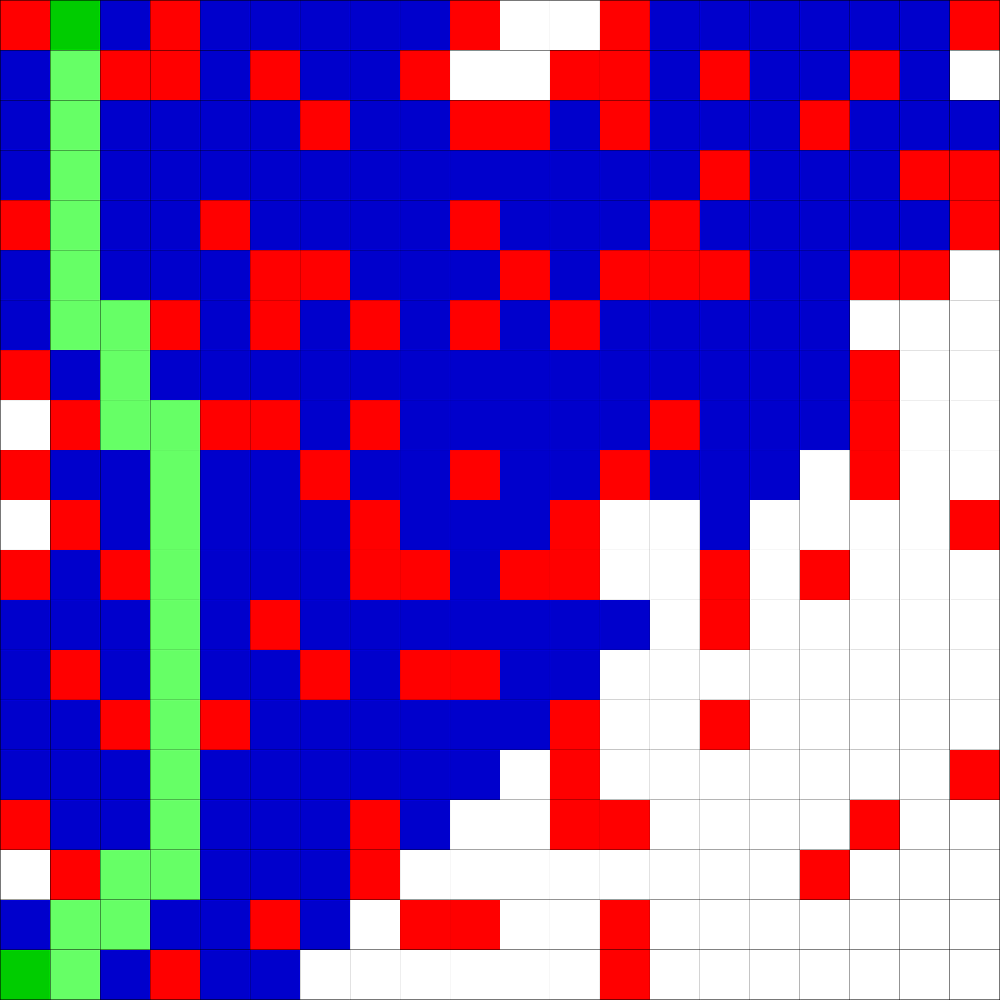
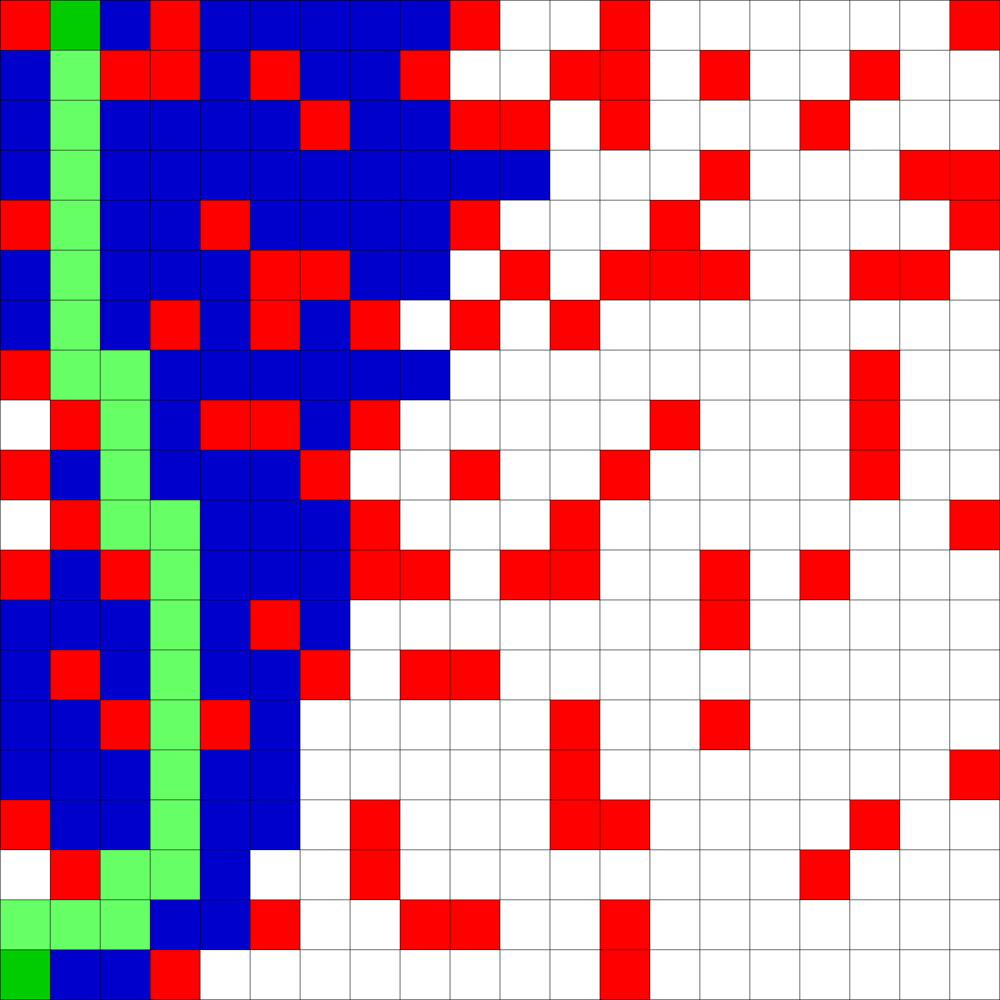
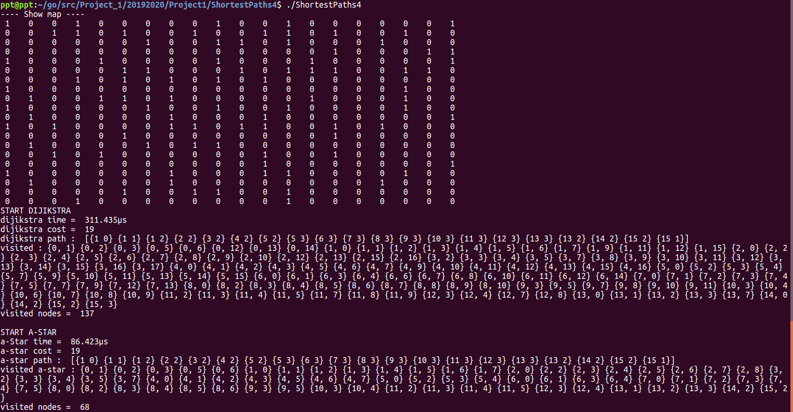

# Find the shortest path

## 2D map 
_ Sinh ra 1 mảng 2 chiều với các giá trị 1 và 0 : 
- 1 : chốt chặn, **không thể đi qua**
- 0 : có thể đi qua được

_ Cách thức sinh mảng : 
- Gọi hàm random từ 0 đến 9
- Với giá trị temp = 0 hoặc = 1, vị trí i,j sẽ là chốt chặn
```go
for i := 0; i < size; i++ {
    for j := 0; j < size; j++ {
        temp := rand.Intn(10)
        if temp > 1 {
            map2d[i][j] = 0
            continue
        }
        map2d[i][j] = 1
}
```
___________
## Graph
_ Cấu trúc edge : đường đi tới 1 node, có trọng số
```go
type nodeTemplate struct {
	x int
	y int
}

type edge struct {
	node   nodeTemplate
	weight int
}
```
_ Cấu trúc graph : 
- mảng 2 chiều
- mỗi 1 nút sẽ chứa đường đi tới các nút xung quanh
```go
var graph [size][size][]edge
```
_________
## Dijikstra + A Star
```go
func dijikstra(xStart, yStart, xDes, yDes int) (int, []nodeTemplate, [size][size]bool) {}
```
```go
func aStar(xStart, yStart, xDes, yDes int) (int, []nodeTemplate, [size][size]bool) {}
```
_ Tham số đầu vào : 
1. Bắt đầu : tọa độ {xStart, yStart}
2. Kết thúc : tọa độ {xDes, yDes}

_ Tham số trả về :
1. Chi phí : *Đang để chi phí từ 1 nút tới nút còn lại là 1*
2. Đường đi
3. Mảng : 
    1. true : nút đã thăm
    2. false : nút chưa thăm

_____
## Draw
_ Tô màu nút :
1. Đỏ : nút bị chặn
2. Xanh da trời : nút đã thăm
3. Xanh lá cây : đường đi ngắn nhất

### Đường đi của Dijikstra


### Đường đi của a-Star


_____
## Màn hình Terminal khi chạy chương trình
